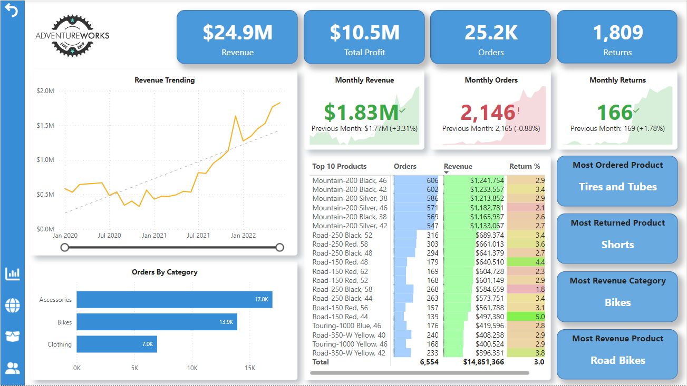
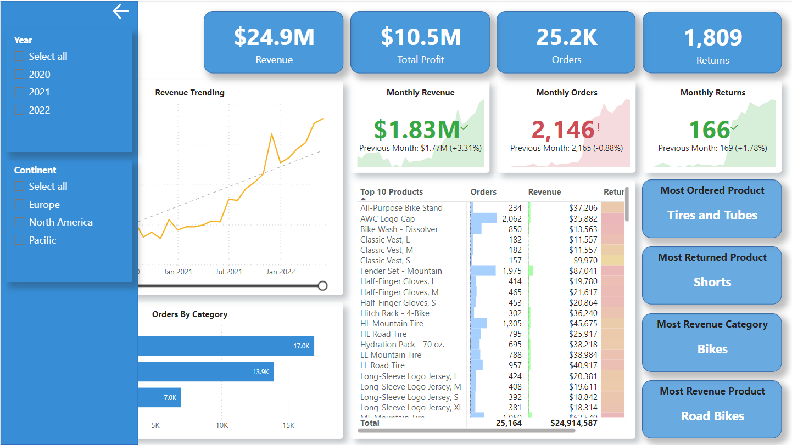
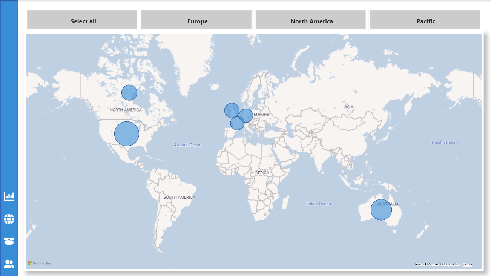
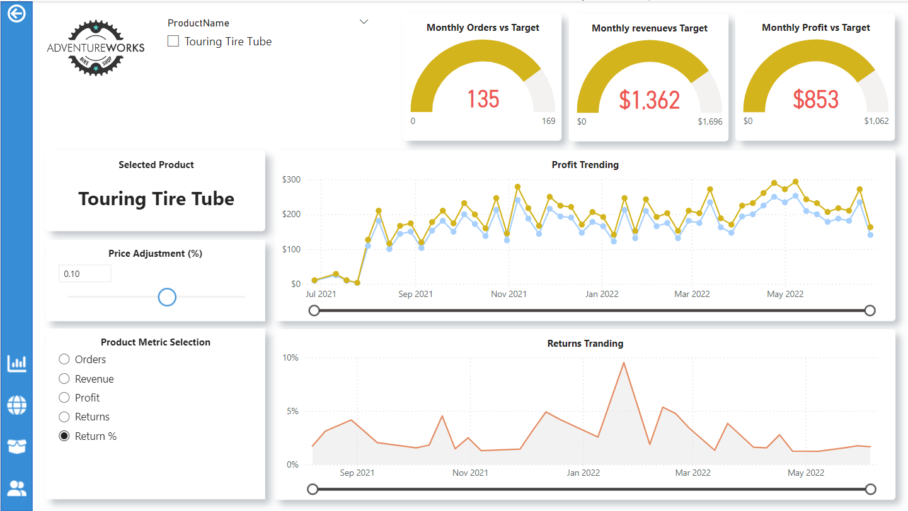
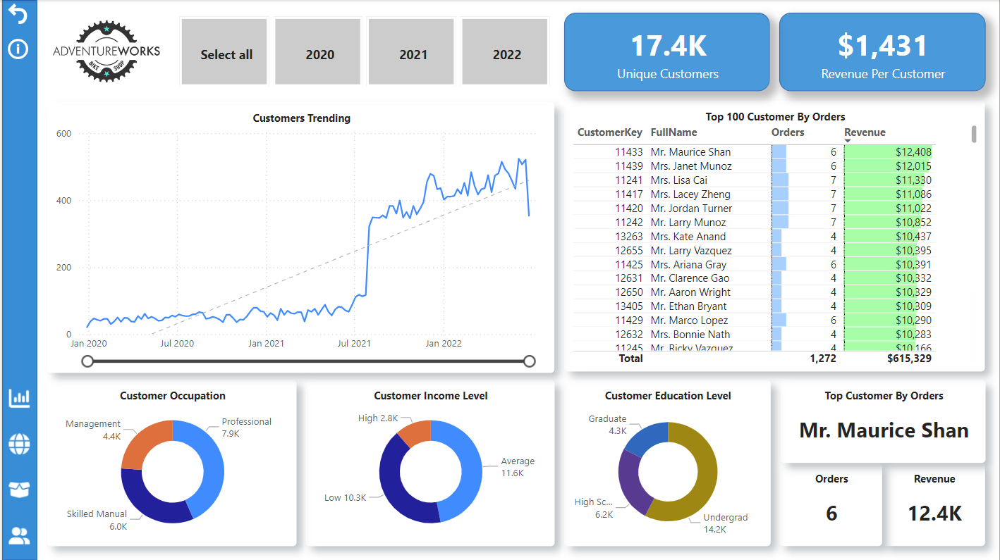

# AdventureWorks 2019 Power BI Analysis

This repository contains a Power BI report that analyzes the AdventureWorks 2019 SQL Server database. The report provides insights into orders, profit, revenue, returns, customer details, and sales by territory.

## Dataset Description

The AdventureWorks 2019 database is a sample database provided by Microsoft. It contains data related to a fictitious, multinational manufacturing company named AdventureWorks Cycles. The database includes information about products, sales, customers, employees, and more.

## Analysis Overview

The Power BI report includes the following analyses:

1. **Orders**: Analysis of the number of orders placed over time.
2. **Profit**: Analysis of profit margins and trends.
3. **Revenue**: Analysis of revenue generated from sales.
4. **Returns**: Analysis of product returns and their impact on revenue.
5. **Customer Details**: Detailed information about customers, including demographics and purchasing behavior.
6. **Sales by Territory**: Analysis of sales performance across different geographical territories.

## Screenshots

### Main Dashboard




### Sales by Territory



### Product Detail



### Customer Details



## Installation and Setup

To set up the environment and load the Power BI report, follow these steps:

1. **Clone the Repository**:

   ```sh
      git clone https://github.com/hugolicea/powerbi-mavenanalytics.git
      cd adventureworks-powerbi
   ```

2. Open the Power BI Report:
   Open AdventureWorks_Analysis.pbix in Power BI Desktop.

3. Connect to the AdventureWorks 2019 Data Raw in the repository:

Once the Power BI report is loaded, you can interact with the various visualizations to gain insights into the AdventureWorks data. Use the filters and slicers to customize the views and drill down into specific details.

### Contributing

We welcome contributions to improve the Power BI report and analyses.

### License

This repository is licensed under the MIT License. See the LICENSE file for more details.
